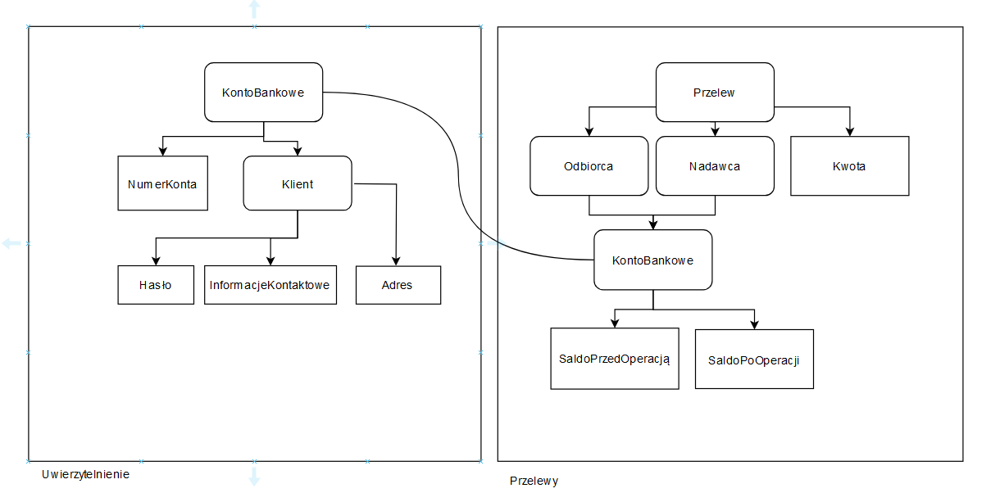

Zadanie polegało na stworzeniu fragmentu modelu systemu bankowego zgodnie z zasadami 
Domain Driven Design. Wyróżnione zostały dwa konteksty - Uwierzytelnienie oraz Przelewy.
Pierwszy z nich opisuje elementy potrzebne do realizacji funkcjonalności uwierzytelnienia
użytkownika w systemie. Z kolei kontekst Przelewy odpowiada za umożliwienie wykonywania
przelewów między klientami banku (ich kontami).

+ Kontekst Uwierzytelnienie

Agregat: KontoBankowe

| Encja/Value Object   | Atrybut       | Format danych                                                     |
|----------------------|---------------|-------------------------------------------------------------------|
| NumerKonta           | accountID     | int, 26-cyfrowa liczba zgodna z budową numerów kont danego banku  |
| Klient               | imie          | string, zawiera jedynie litery                                    |
| Klient               | nazwisko      | string, zawiera jedynie litery                                    |
| Haslo                | haslo         | string, od 15 do 30 znaków, musi zawierać znaki specjalne i cyfry |
| InformacjeKontaktowe | numerTelefonu | int, 9 znaków                                                     |
| InformacjeKontaktowe | email         | string, do 15 znaków, może zawierać litery, kropki i małpę        |
| Adres                | ulica         | string, tylko litery do 20 znaków                                 |
| Adres                | kodPocztowy   | string, 6 znaków, 2 cyfry połączone "-" z 3 cyframi               |
| Adres                | miasto        | string, litery, do 30 znaków                                      |

+ Kontekst Przelewy

| Encja/Value Object | Atrybut            | Format danych               |
|--------------------|--------------------|-----------------------------|
| Kwota              | ilośćWaluty        | float, 2 cyfry po przecinku |
| Kwota              | waluta             | string, trzy litery         |
| Odbiorca           | kontoBankowe       | VO                          |
| Nadawca            | kontoBankowe       | VO                          |
| KontoBankowe       | SaldoPrzedOperacją | VO                          |
| KontoBankowe       | SaldoPoOperacją    | VO                          |
| SaldoPrzedOperacją | ilośćWaluty        | float, 2 cyfry po przecinku |
| SaldoPrzedOperacją | waluta             | string, trzy litery         |
| SaldoPoOperacji    | ilośćWaluty        | float, 2 cyfry po przecinku |
| SaldoPpOperacji    | waluta             | string, trzy litery         |